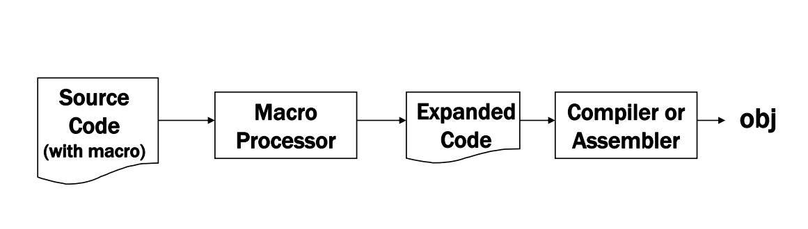
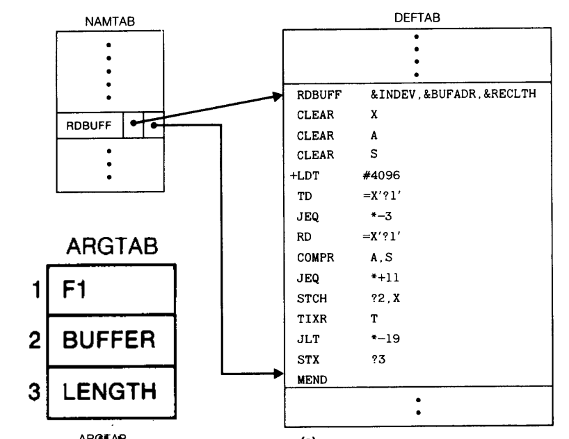

import ViewCount from '../../../src/components/ViewCount'

# Macros

Macros are similar to subroutines but unlike subroutines they exist only
until your code is compiled, after compilation all macros are replaced with real instructions. If
you declared a macro and never used it in your code, The compiler will simply ignore it.

* A macro call leads to its expansion, whereas subroutine call leads to its execution. So there is
  difference in size and execution efficiency.
* Statements of the macro body are expanded each time the macro is invoked. But the statements of
  the subroutine appear only once, regardless of how many times the subroutine is called


## Macro Processor

The macro pre-processor(or macro processor) is a system software which replaces
each macro instruction with the corresponding group of source language statements.



## One pass macro processor

A one-pass macro processor that can alternate between macro definition and macro expansion

* Macro definitions are stored in DEFTAB
* Comment lines are not entered the DEFTAB.
* The macro names are entered into NAMTAB, NAMTAB contains two pointers to the beginning and the
  end of the definition in DEFTAB
* The third data structure is an argument table ARGTAB, which is used during the expansion of macro
  invocations.
* The arguments are stored in ARGTAB according to their position in the argument list.



## C code for 1 pass macro processor

Simple c program for one pass macro processor.

NOTE: This program does not support nested macros.


```c:title=macro.c
// Raptor INC 2022
#include <stdio.h>
#include <stdlib.h>
#include <string.h>

// Nametab Structure
struct Namtab {
    char name[10];
    int start;
    int end;
};

// Deftab
char Deftab[1000];
struct Namtab Namtabs[10];
int NamtabCount = 0; // Number of entries in Namtab

// Check if the given name is a macro (if it is in the namtab)
int isMacro(char *word) {
    for (int i = 0; i < NamtabCount; i++) {
        if (strcmp(word, Namtabs[i].name) == 0) {
            return i;
        }
    }
    return -1;
}

// Function to strip , \n and \t from the string
void stripSymbols(char *line) {
  int size = strlen(line);
  for (int i = 0; i < size; i++) {
      if (line[i] == '\t' || line[i] == ',') {
          line[i] = ' ';
      }
  }
  if (line[size - 1] == '\n') {
      line[size - 1] = '\0';
  }
}

// To get words in a line "COPY START 1000" should give array [COPY,START,1000]
void getInstructions(char *line, char *instructions[], int *instructionCount) {
    stripSymbols(line);
    int i = 0;
    // strtok splits the line into words by space
    char *token = strtok(line, " ");
    while (token != NULL) {
        // ommits empty spaces (string of length 0)
        if (strlen(token) > 0) {
            instructions[i] = token;
            i++; // increment word count
        }
        // get next token (word)
        token = strtok(NULL, " "); 
    }

    // set instruction count as word count
    *instructionCount = i;
}

// Define macro by adding it to the namtab and deftab
void defineMacro(FILE *inputFile, char *macroDefinition[], int macroDefCount) {
    char *macroName = macroDefinition[0];
    int argCount = macroDefCount - 2; // Get number of arguments

    // add macro name to namtab
    strcpy(Namtabs[NamtabCount].name, macroName);

    char macroLine[100];
    char *macroInstructions[10];
    int macroInstructionCount;

    // Add macro definition to deftab
    for (int i = 0; i < macroDefCount; i++) {
      strcat(Deftab, macroDefinition[i]);
      strcat(Deftab, " ");
    }
    // Add newline
    strcat(Deftab, "\n");

    Namtabs[NamtabCount].start = strlen(Deftab); // set start of macro definition body
    // Add macro body to deftab
    while (fgets(macroLine, 100, inputFile)) {
        getInstructions(macroLine, macroInstructions, &macroInstructionCount);
        if (macroInstructionCount == 0) {
            continue; // skip empty lines
        }
        // Check word by word
        for (int i = 0; i < macroInstructionCount; i++) {
            char *word = macroInstructions[i];
            // substitute positional notation
            for (int j = 0; j < argCount; j++) {
                // Check if word is matching with argument
                if (strcmp(word, macroDefinition[j + 2]) == 0) {
                    // Replace argument with &j
                    strcpy(word, "& ");
                    word[1] = j + '0'; // number to char (only works for 0-9)
                }
            }
            // Write to deftab
            strcat(Deftab, word);
            strcat(Deftab, " "); // add space between words
        }
        // Add newline
        strcat(Deftab, "\n");

        // Check if MEND
        if (strcmp(macroInstructions[0], "MEND") == 0) {
            break;
        }
    }

    // set end of macro definition
    Namtabs[NamtabCount].end = strlen(Deftab) - 6; // -6 to remove MEND
    // increment namtab count
    NamtabCount++;
}

// Expand macro by writing it to the output file
void expandMacro(FILE *outputFile, char *macroName, char *argTab[], int macroArgCount) {
    int macroIndex = isMacro(macroName);
    int macroStart = Namtabs[macroIndex].start;
    int macroEnd = Namtabs[macroIndex].end;

    // Write macro definition to output file
    for (int i = macroStart; i < macroEnd; i++) {
        char c = Deftab[i];
        // Check if positional notation
        if (c == '&') {
            // Get argument number
            int argNumber = Deftab[i + 1] - '0';
            // Write argument to output file
            fprintf(outputFile, "%s ", argTab[argNumber]);
            i++; // skip next character
        } else {
            // Write character to output file
            fprintf(outputFile, "%c", c);
        }
    }
}

int main() {
    FILE *inputFile, *outputFile;
    inputFile = fopen("input.txt", "r");
    outputFile = fopen("output.txt", "w");

    char line[100];
    char *instructions[10]; // array of instructions (words) in a line 
    int instructionCount;

    while (fgets(line, 100, inputFile)) {
        getInstructions(line, instructions, &instructionCount);
        if (instructionCount == 0) {
            continue;
        }
        if (strcmp(instructions[0], "END") == 0) {
            break;
        } else if (strcmp(instructions[1], "MACRO") == 0) {
            defineMacro(inputFile, instructions, instructionCount);
        } else if (isMacro(instructions[0]) != -1) { // check if 1st word is a macro
            char **argTab = &instructions[1]; // arguments start from second position
            expandMacro(outputFile, instructions[0], argTab, instructionCount - 1);
        } else if (isMacro(instructions[1]) != -1) { // check if 2nd word is a macro
            char **argTab = &instructions[2]; // arguments start from third position
            expandMacro(outputFile, instructions[1], argTab, instructionCount - 2);
        }
        else {
            // Write to output file
            for (int i = 0; i < instructionCount; i++) {
                fprintf(outputFile, "%s ", instructions[i]);
            }
            fprintf(outputFile, "\n");
        }
    }

    printf("Namtab:\n");
    for (int i = 0; i < NamtabCount; i++) {
        printf("%s %d %d\n", Namtabs[i].name, Namtabs[i].start, Namtabs[i].end);
    }
    printf("\nDeftab:\n%s\n", Deftab);
    printf("Check output.txt for expanded code\n");
    return 0;
}
```

## Input

Input file (SIC/XE code) with 2 macros (EX1 and MyMacro)

```c:title=input.txt
EX1 MACRO &A, &B
LDA &A
STA &B
MEND

MyMacro MACRO &p1, &p2, &p3
     MOV AX, &p1
     MOV BX, &p2
     MOV CX, &p3
MEND

SAMPLE START 1000
EX1 N1,N2
MyMacro 1, 2, 3
MyMacro 4, 5, DX
N1 RESW 1
N2 RESW 1
END
```

## Output

Output of the program

```c:title=console
Namtab:
EX1 17 33
MyMacro 66 99

Deftab:
EX1 MACRO &A &B
LDA &0
STA &1
MEND
MyMacro MACRO &p1 &p2 &p3
MOV AX &0
MOV BX &1
MOV CX &2
MEND

Check output.txt for expanded code
```

Output.txt

```c:title=output.txt
SAMPLE START 1000 
LDA N1  
STA N2  
MOV AX 1  
MOV BX 2  
MOV CX 3  
MOV AX 4  
MOV BX 5  
MOV CX DX  
N1 RESW 1 
N2 RESW 1 
```

## References

* [system programing](http://ctyang.thu.edu.tw/files/sp_chap4.pdf)

<ViewCount/>
