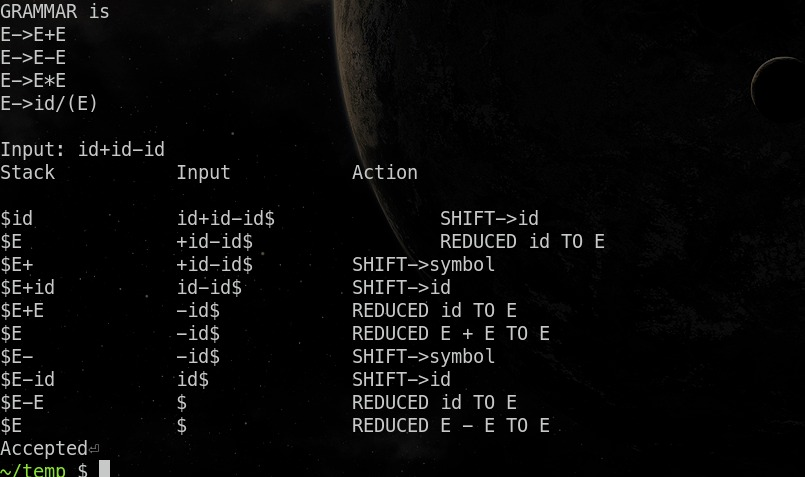

import ViewCount from '../../../src/components/ViewCount'

## C code

<br/>

```c:title=sr.c
// RAPTOR INC 2022
#include<stdio.h>
#include<string.h>

struct Stack {
    int top;
    char array[100];
};

void push(struct Stack *stack, char item) { stack->array[++stack->top] = item; }
void pop(struct Stack *stack, int count) { stack->top -= count; }

void print(struct Stack *stack) { // print stack
    for (int i = 0; i <= stack->top; i++)
        if (stack->array[i] == 'i')
            printf("id");
        else
            printf("%c", stack->array[i]);
}

int reduce(struct Stack *stack) {
    int action = 0;
    int i = stack->top;
    if (i == -1) {
        return action;
    }
    if (stack->array[i] == 'i') { // E->id
        pop(stack, 1);
        push(stack, 'E');
        action = 1;
    } else if (stack->array[i] == ')' && stack->array[i-1] == 'E' && stack->array[i-2] == '(') { // E->(E)
        pop(stack, 3);
        push(stack, 'E');
        action = 2;
    } else if (stack->array[i] == 'E' && stack->array[i-1] == '*' && stack->array[i-2] == 'E') { // E->E*E
        pop(stack, 3);
        push(stack, 'E');
        action = 3;
    } else if (stack->array[i] == 'E' && stack->array[i-1] == '+' && stack->array[i-2] == 'E') { // E->E+E
        pop(stack, 3);
        push(stack, 'E');
        action = 4;
    } else if (stack->array[i] == 'E' && stack->array[i-1] == '-' && stack->array[i-2] == 'E') { // E->E-E
        pop(stack, 3);
        push(stack, 'E');
        action = 5;
    }

    return action; // 0 means cant reduce
}

int main() {
    struct Stack stack;
    stack.top = -1;
    push(&stack, '$');

    printf("GRAMMAR is\nE->E+E\nE->E-E\nE->E*E\nE->id/(E)\n\nInput: ");
    char input[100];
    scanf("%s", input);
    printf("Stack\t\tInput\t\tAction\n");

    int inputLen = strlen(input);
    int i = 0;
    input[inputLen] = '$'; // Add $ at the end of string
    input[inputLen+1] = '\0';
    while (i < inputLen || stack.top != 1) {
        printf("\n");
        int reduceAction = reduce(&stack);

        if (reduceAction == 0) {
            if (i >= inputLen) { // Rejection condition (cant reduce and no more input)
                printf("\nRejected");
                return 0;
            }
            if (input[i] == 'i' && input[i + 1] == 'd') {
                push(&stack, 'i');
                print(&stack);
                printf("\t\t%s", &input[i]);
                printf("\t\tSHIFT->id");
                i++;
            } else {
                push(&stack, input[i]);
                print(&stack);
                printf("\t\t%s", &input[i]);
                printf("\t\tSHIFT->symbol");
            }            

            i++;
        } else if (reduceAction == 1){ // id-> id
            print(&stack);
            printf("\t\t%s ", &input[i]);
            printf("\t\tREDUCED id TO E");
        } else if (reduceAction == 2) { // E-> (E)
            print(&stack);
            printf("\t\t%s ", &input[i]);
            printf("\t\tREDUCED (E) TO E");
        } else if (reduceAction == 3) { // E-> E*E
            print(&stack);
            printf("\t\t%s ", &input[i]);
            printf("\t\tREDUCED E * E TO E");
        } else if (reduceAction == 4) { // E->E+E
            print(&stack);
            printf("\t\t%s ", &input[i]);
            printf("\t\tREDUCED E + E TO E");
        } else if (reduceAction == 5) { // E->E-E
            print(&stack);
            printf("\t\t%s ", &input[i]);
            printf("\t\tREDUCED E - E TO E");
        }
    }

    printf("\nAccepted");
    return 0;
}
```


## Output

* Output 




<ViewCount/>


