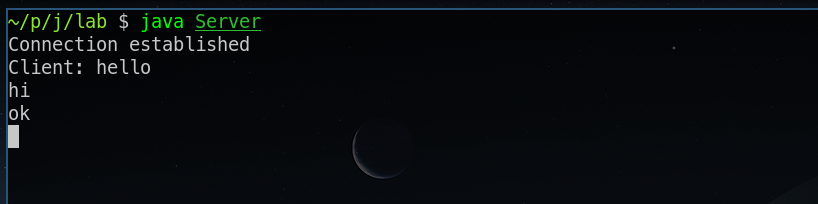
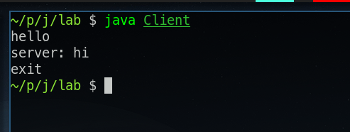

import ViewCount from '../../../src/components/ViewCount'

## Server code

<br/>

```js:title=Server.java
// receives data and sends data 
import java.io.*; 
import java.net.*; 

class Server { 
    public static void main(String args[]) throws Exception { 
        // Create server Socket 
        ServerSocket server = new ServerSocket(6969); 

        // to read data from the keyboard 
        BufferedReader kb = new BufferedReader(new InputStreamReader(System.in)); 
        while (true) { 
            // connect it to client socket 
            Socket s = server.accept(); 
            System.out.println("Connection established"); 
            // to send data to the client 
            PrintStream ps = new PrintStream(s.getOutputStream()); 

            // to read data coming from the client 
            BufferedReader br = new BufferedReader(new InputStreamReader(s.getInputStream())); 
            String str, str1; 
            // repeat as long as the client 
            // does not send a null string 
            // read from client 

            str = br.readLine();
            while (str != null) { 
                System.out.println("Client: " + str); 
                str1 = kb.readLine(); 

                // send to client 
                ps.println("server: " + str1); 
                str = br.readLine();
            } 

            // close connection 
            ps.close(); 
            br.close(); 
            s.close(); 

        } // end of while 
    } 
}
```

## Client code

<br/>

```js:title=Client.java
import java.io.*; 
import java.net.*; 

class Client { 
    public static void main(String args[]) throws Exception 
    { 
        // Create client socket 
        Socket s = new Socket("localhost", 6969);
        // to send data to the server 
        DataOutputStream dos = new DataOutputStream(s.getOutputStream()); 
        // to read data coming from the server 
        BufferedReader br = new BufferedReader( new InputStreamReader(s.getInputStream())); 
        // to read data from the keyboard 
        BufferedReader kb = new BufferedReader(new InputStreamReader(System.in)); 

        String str, str1; 
        // repeat as long as exit 
        // is not typed at client 
        while (!(str = kb.readLine()).equals("exit")) { 
            // send to the server 
            dos.writeBytes(str + "\n"); 
            // receive from the server 
            str1 = br.readLine(); 
            System.out.println(str1); 
        } 

        // close connection. 
        dos.close(); 
        br.close(); 
        kb.close(); 
        s.close(); 
    } 
}
```

## Output

* Server



* Client



<ViewCount/>
