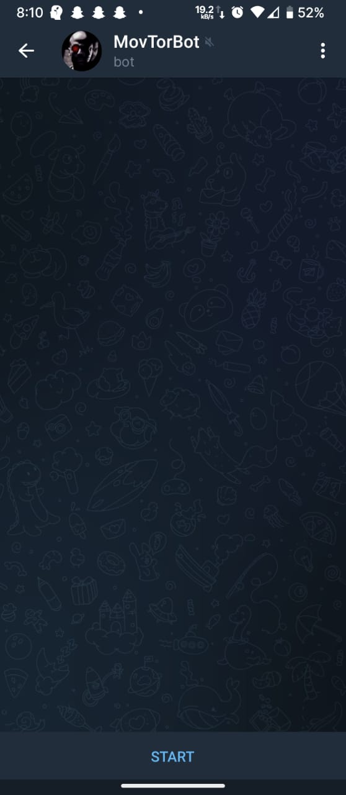
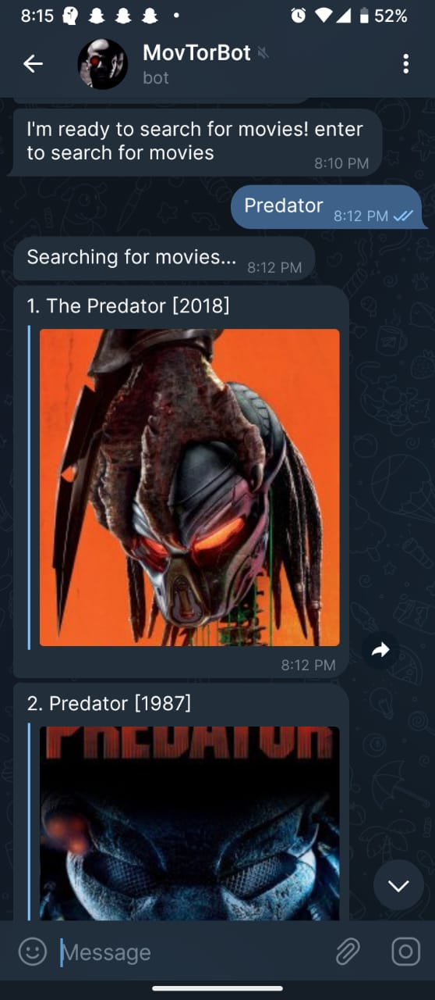
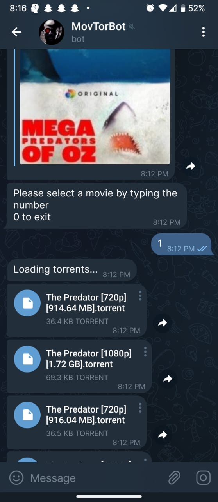
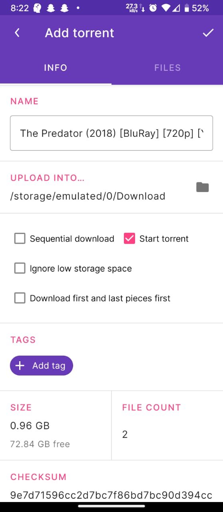

import ViewCount from '../../../src/components/ViewCount';

## [MovTorBot](https://t.me/m1_2022_bot)

I have created a telegram bot to download movies. It is easy and convenient to download using my
bot, The bot will provide a torrent file for the movie searched. 

The bot is made using NodeJS and typescript and uses YTS api for getting movies.

## How to use it

* Go to [MovTorBot](https://t.me/m1_2022_bot)
    

* Just enter the movie name.

* Select the desired movie from the list by typing the number.

* Download torrent (Use Libre Torrent to download torrents, it's free and open source).

## Source code

You can find source code [here](https://github.com/superRaptor911/TelegramMovieBot)

<ViewCount/>
