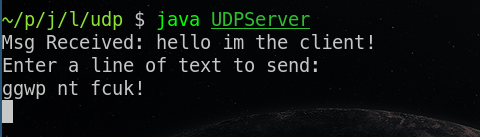
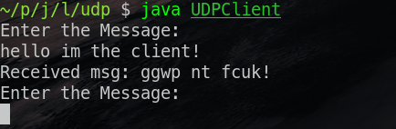

import ViewCount from '../../../src/components/ViewCount'

## Server code

<br/>

```js:title=UDPServer.java
import java.io.*;
import java.net.*;
import java.lang.*;
class UDPServer
{
    public static void main(String a[])throws IOException
    {
        DatagramSocket socket = new DatagramSocket(6969);
        BufferedReader br = new BufferedReader(new InputStreamReader(System.in));
        byte buffer[] = new byte[256];

        while(true)
        {
            DatagramPacket packet = new DatagramPacket(buffer, buffer.length);
            socket.receive(packet);

            String received = new String(packet.getData(), 0, packet.getLength());
            System.out.println("Msg Received: " + received);

            InetAddress address = packet.getAddress();
            int port = packet.getPort();

            System.out.println("Enter a line of text to send:");
            String message = br.readLine();
            byte[] bytes = message.getBytes();
            DatagramPacket packet2 = new DatagramPacket(bytes, bytes.length, address, port);
            socket.send(packet2);

            if(message.equals("exit"))
                break;
        }
    }
}
```

## Client code

<br/>

```js:title=UDPClient.java
import java.io.*;
import java.net.*;
class UDPClient
{
    public static void main(String a[])throws Exception
    {
        DatagramSocket socket = new DatagramSocket();
        BufferedReader br = new BufferedReader(new InputStreamReader(System.in));
        InetAddress address = InetAddress.getLocalHost();

        byte bytes[] = new byte[256];
        byte buffer[] = new byte[256];
        while(true) {
            System.out.println("Enter the Message:");
            String msg = br.readLine();
            bytes = msg.getBytes();

            DatagramPacket packet = new DatagramPacket(bytes, bytes.length, address, 6969);
            socket.send(packet);

            if(msg.equals("exit"))
                break;

            packet = new DatagramPacket(buffer, buffer.length);
            socket.receive(packet);
            String message = new String(packet.getData(), 0, packet.getLength());
            System.out.println("Received msg: " + message);
        }
    }
}  

```

## Output

* Server



* Client



<ViewCount/>
